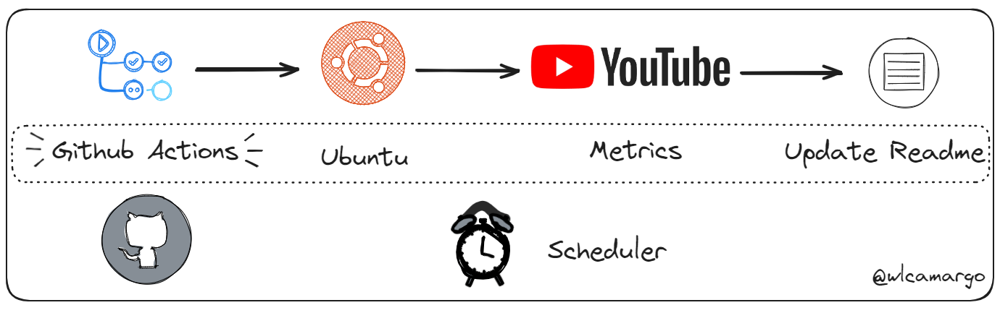

# Update Readme with Github Actions

## 📊 Métricas do canal

  

    
  

  

    
  

## 📺 Vídeos Recentes

<!-- YOUTUBE:START --><table><tr><td></td>
<td><a href="https://www.youtube.com/watch?v=SGnqbHoiCDY">CI &lpar;Teste automatizado&rpar; com Jenkins, Github  e Python</a> Jul 29, 2024</td></tr></table>
<table><tr><td></td>
<td><a href="https://www.youtube.com/watch?v=r0X-c7lWT8U">Catalogando dados do Minio + Postgres com Open Metadata</a> Jul 16, 2024</td></tr></table>
<table><tr><td></td>
<td><a href="https://www.youtube.com/watch?v=jYVmd-trlr4">Subindo containers com o Docker Compose - Protegendo palavras sensíveis</a> Jun 21, 2024</td></tr></table>
<table><tr><td></td>
<td><a href="https://www.youtube.com/watch?v=Njuc7Uw7GZE">Dashboard Open Source com Apache Superset</a> Jun 3, 2024</td></tr></table>
<table><tr><td></td>
<td><a href="https://www.youtube.com/watch?v=b5jug57mStg">Consulta Federada com o Trino</a> May 20, 2024</td></tr></table>
<!-- YOUTUBE:END -->

## Developer

[Wallace Camargo](https://www.linkedin.com/in/wallace-camargo-35b615171/) 

## References

https://github.com/julioarruda

