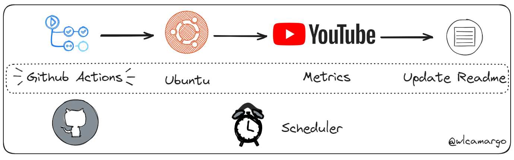

# Update Readme with Github Actions

## 📊 Métricas do canal

  

    
  

  

    
  

## 📺 Vídeos Recentes

<!-- YOUTUBE:START --><table><tr><td></td>
<td><a href="https://www.youtube.com/watch?v=v1gMhd7q-W8">Build Your Own Data Engineering Lab &lpar;100% Local &amp; Free with Docker&rpar;</a> May 3, 2026</td></tr></table>
<table><tr><td></td>
<td><a href="https://www.youtube.com/watch?v=WSuZn6cBkYY">Evangelizando SQL - Fabric Vale a Pena? [Com Luciano Borba]</a> Feb 27, 2026</td></tr></table>
<table><tr><td></td>
<td><a href="https://www.youtube.com/watch?v=428x3EYl4SQ">Setup de Estudo Local para Engenharia de Dados</a> Dec 1, 2025</td></tr></table>
<table><tr><td></td>
<td><a href="https://www.youtube.com/watch?v=8fmSFYOKmJI">App de validação de dados com Streamlit</a> Aug 11, 2025</td></tr></table>
<table><tr><td></td>
<td><a href="https://www.youtube.com/watch?v=kiq0tzC1Q6Y">Produto de dados &lpar;streamlit + airflow + s3/minio&rpar;</a> Jul 21, 2025</td></tr></table>
<!-- YOUTUBE:END -->

## Developer

[Wallace Camargo](https://www.linkedin.com/in/wallace-camargo-35b615171/) 

## References

https://github.com/julioarruda

